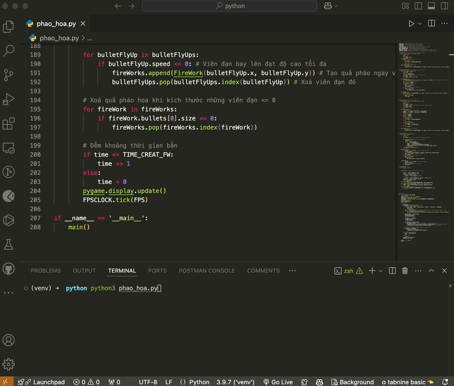

# Code pháo hoa


# Cách dùng (áp dụng cho mac/linux)
1. Tạo `venv`: 
```bash
➜ python3 -m venv venv
```

2. Cài các thư viện cần thiết
```bash
(venv) ➜ pip install -r requirements.txt
```

3. Chạy code
```bash
(venv) ➜ python3 phao_hoa.py 
```